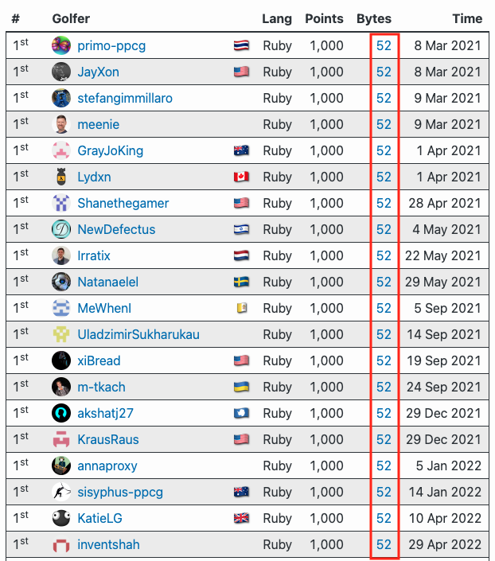
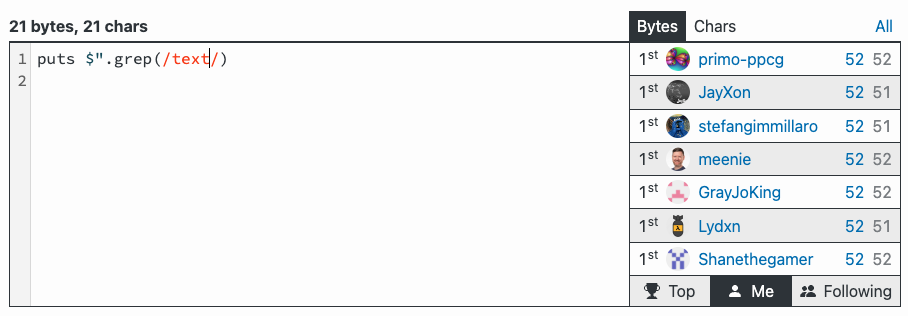
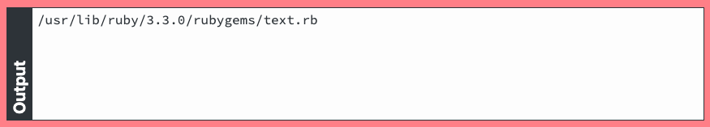
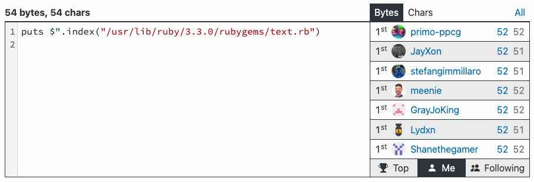
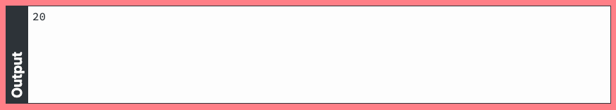

<style type="text/css">
  .reveal pre {
    font-size: 0.60em;
    width: 100%;
  }

  pre.normal {
    font-size: 0.55em;
  }

  pre.medium {
    font-size: 0.7em;
  }

  pre.large {
    font-size: 0.9em;
  }

  pre.small {
    font-size: 0.40em;
  }

  .monospace {
    font-family: monospace !important;
  }


.reveal section img {
  border: none;
}

</style>

## Code golf
## in Ruby
## ⛳

Radosław Bułat, github.com/radarek
KRUG, 17.09.2024

---

## Before we start...

---

## Agenda

* What is the code golf?
* Code golf example
* Magic moments
* Where to golf?

***

## What is the code golf?

---

Code golf is a discipline

{:.fragment}
in which we solve programming challenges

{:.fragment}
using the fewest characters possible.

---

Just like in real golf
we want to reach the goal ⛳
with as few strokes 🏌 as possible.

---

Only two criteria are important:
* correctness
* code length (the less the better)

***

***

## First hole

---

Write a code that takes a string
and returns first word that is repeated.

{:.fragment}
Words are separated by spaces and are all lowercase.

---

```ruby
"dom kot pies okno żyrandol pies dom szafa" -> "pies"
 ---     ----               ---- ---
```

---

### Let's start with ungolfed version.

---

{:.normal}
```ruby
def first_repeating_word(string)
  words = string.split
  seen = {}

  words.find do |word|
    if seen[word]
      true
    else
      seen[word] = true
      false
    end
  end
end
```

{:.fragment}
```ruby
first_repeating_word(
  "dom kot pies okno żyrandol pies dom szafa"
) #=> "pies"
```

{:.fragment}
### 183 bytes

---

### This is our starting point.
### Let's see how much we can shrink it!

---

### Let's apply golf tricks one by one.

---

### Use single letter names for everything.

---

`first_repeating_word` -> `f`
`string` -> `s`
`words` -> `a`
`word` -> `w`

---

```ruby
def f(s)
  a = s.split
  h = {}

  a.find do |w|
    if h[w]
      true
    else
      h[w] = true
      false
    end
  end
end
```

{:.fragment}
### 128 bytes

---

### Remove unnecessary spaces.

---

{:.large}
```ruby
h = {}
```
->

{:.large}
```ruby
h={}
```

---

{:.large}
```ruby
do |w|
```
->

{:.large}
```ruby
do|w|
```

etc.

---

```ruby
def f(s)
a=s.split
h={}
a.find do|w|
if h[w]
true
else
h[w]=true
false
end
end
end
```

{:.fragment}
### 82 bytes

---

### Use `{}` blocks instead of `do end`.

---

{:.large}
```ruby
a.find do|w|
end
```
->

{:.large}
```ruby
a.find{|w|
}
```

---

```ruby
def f(s)
a=s.split
h={}
a.find{|w|
if h[w]
true
else
h[w]=true
false
end
}
end
```

{:.fragment}
### 78 bytes

---

### Do not use variables
### if they are not needed.

---

{:.large}
```ruby
a=s.split
a.find{|w|
```
->

{:.large}
```ruby
s.split.find{|w|
```

---

```ruby
def f(s)
h={}
s.split.find{|w|
if h[w]
true
else
h[w]=true
false
end
}
end
```

### 74 bytes

---

### Use `?:` ternary if operator instead of `if else end`.

---

{:.large}
```ruby
if condition
  expression1
else
  expression2
end
```
->

{:.large}
```ruby
condition ? expression1 : expression2
```

---

{:.large}
```ruby
def f(s)
h={}
s.split.find{|w|
h[w]?true:(h[w]=true;false)
}
end
```

### 64 bytes

---

### Use lambda `->` instead of method definition.

---

{:.large}
```ruby
def f(s)
end
```
->

{:.large}
```ruby
f=->s{}
```

---

{:.large}
```ruby
f=->s{
h={}
s.split.find{|w|
h[w]?true:(h[w]=true;false)
}
}
```

### 60 bytes

---

### Remove unnecessary new lines.

{:.fragment}
#### Other new lines replace with `;`

{:.fragment}
##### (just for convenience ;-))

---

{:.medium}
```ruby
f=->s{h={};s.split.find{|w|h[w]?true:(h[w]=true;false)}}
```

### 56 bytes

---

### Use shorter truthy expressions than `true` literal.

---

Everything except `false` and `nil` is treated as `true` in conditions.

{:.large}
```ruby
0
1
"f"
:f
{}
[]
# all are truthy
```

---

{:.medium}
```ruby
f=->s{h={};s.split.find{|w|h[w]?1:(h[w]=1;false)}}
```

### 50 bytes

---

### Use shorter falsy expressions than `false` literal.

---

{:.large}
```ruby
!0
!1
!"f"
!:f
!{}
![]
# all are falsy
```

---

### Is there a 1 character expression which evaluates to `falsy` value?

---

## p

---

# ???

---

## Kernel#p

---

{:.large}
```ruby
p(1) # prints 1, returns 1
p()  # prints nothing, returns nil
p    # prints nothing, returns nil
```

---

{:.medium}
```ruby
f=->s{h={};s.split.find{|w|h[w]?1:(h[w]=1;p)}}
```
### 46 bytes

---

### Use `_1`, `_2` block variables

---

{:.medium}
```ruby
f=->s{h={};s.split.find{h[_1]?1:(h[_1]=1;p)}}
```

### 45 bytes

---

### Now the fun begins!

---

{:.large}
```ruby
h[_1]?1:(h[_1]=1;p)
```

{:.fragment .large}
```ruby
h[_1]?1:!h[_1]=1
```

---

{:.large}
```ruby
f=->s{h={};s.split.find{h[_1]?1:!h[_1]=1}}
```

### 42 bytes

---

{:.large}
```ruby
h[_1]?1:!h[_1]=1
```

{:.fragment .large}
```ruby
h[_1]||!h[_1]=1
```

---

{:.large}
```ruby
f=->s{h={};s.split.find{h[_1]||!h[_1]=1}}
```

### 41 bytes

---

{:.large}
```ruby
h[_1]||!h[_1]=1
```

{:.fragment .large}
```ruby
!h[_1]=!h[_1]
```

---

{:.large}
```ruby
f=->s{h={};s.split.find{!h[_1]=!h[_1]}}
```

### 39 bytes

---

{:.large}
```ruby
h={};
```

{:.fragment .large}
```ruby
->s,**h{} # use ruby keyword arguments
```

---

{:.large}
```ruby
f=->s,**h{s.split.find{!h[_1]=!h[_1]}}
```

### 38 bytes

---

{:.large}
```ruby
h[_1]=!h[_1]
```

{:.fragment .large}
```ruby
nil^1  #=> true
true^1 #=> false
```

{:.fragment .large}
```ruby
h[_1]=h[_1]^1
h[_1]^=1
```

---

{:.large}
```ruby
f=->s,**h{s.split.find{!h[_1]^=1}}
```

### 34 bytes

---

### Before vs After

---

```ruby
def first_repeating_word(string)
  words = string.split
  seen = {}

  words.find do |word|
    if seen[word]
      true
    else
      seen[word] = true
      false
    end
  end
end
```

```ruby
f=->s,**h{s.split.find{!h[_1]^=1}}
```

---

### Evolution of solutions

```ruby
f=->s{h={};s.split.find{|w|h[w]?true:(h[w]=true;false)}}
f=->s{h={};s.split.find{|w|h[w]?1:(h[w]=1;false)}}
f=->s{h={};s.split.find{|w|h[w]?1:(h[w]=1;p)}}
f=->s{h={};s.split.find{h[_1]?1:(h[_1]=1;p)}}
f=->s{h={};s.split.find{h[_1]?1:!h[_1]=1}}
f=->s{h={};s.split.find{h[_1]||!h[_1]=1}}
f=->s{h={};s.split.find{!h[_1]=!h[_1]}}
f=->s,**h{s.split.find{!h[_1]=!h[_1]}}
f=->s,**h{s.split.find{!h[_1]^=1}}
```

***

***

## The alphabet

---

{:.fragment}
### Single character strings

```ruby
?a
??
?ę
```

{:.fragment}
```ruby
"a"
"?"
"ę"
```

---

## SIDEQUEST
### Can you parse this?
#### (Ruby can)

{:.large}
```ruby
?????:??
```

{:.fragment .large}
```ruby
?? ? ?? : ??
```

{:.fragment .large}
```ruby
"?" ? "?" : "?" #=> "?"
```

---

{:.fragment}
### Joining arrays

{:.large}
```ruby
[1,2,3,4]*''
[1,2,3,4]*"x"
```

{:.fragment .large}
```ruby
[1,2,3,4].join    #=> "1234"
[1,2,3,4].join"x" #=> "1x2x3x4"
```

{:.fragment .large}
```ruby
[1,2,3,4]*?x      #=> "1x2x3x4"
```

---

{:.fragment}
### Array#uniq

{:.large}
```ruby
a&a
a|a
a|[]
```

{:.fragment .large}
```ruby
a.uniq
```

---

{:.fragment .large}
### n-1, n+1

{:.large}
```ruby
~-n
-~n
```

{:.fragment .large}
```ruby
n-1
n+1
```

{:.fragment}
### What's the point then?

{:.fragment .large}
```ruby
m*(n+1)
m*-~n
```

---

{:.fragment}
### Operator methods

{:.large}
```ruby
"%f".%1.0+0.5
```

{:.fragment .large}
```ruby
"%f"%(1.0+0.5)
```

---

### There are many more things like this.

---

### Discovering them is just fun!

***

***

### Magic moments

---

### The story of one challenge

---

https://code.golf/levenshtein-distance#ruby

---



---

Usually means one of:
* the problem is simple to solve
* the solution is available publicly
* there is a built-in

---

### 1st and 2nd were eliminated.

---

### Searching in the source code I found a method

{:.medium}
```ruby
DidYouMean::Levenshtein.distance("foo", "fo") #=> 1
```

---

### That lead me to 52 bytes solution

{:.medium}
```ruby
$*.map{p DidYouMean::Levenshtein.distance *_1.split}
```

---

### I was about to stop here but...

---

### ...I found this

{:.small}
```plain
$ grep -Ri levenshtein .
(...)
./3.1.0/rubygems/text.rb:
# Vendored version of DidYouMean::Levenshtein.distance from the ruby/did_you_mean gem @ 1.4.0
                      --------------------------------
```

---

### It looked like the code in my solution
# 🤔

---

### Then I checked this...



{:.fragment}


---

### ...and this



{:.fragment}


---

* file `rubygems/text.rb` is autoloaded
* path to the file is in `$"[20]`
* the file contains the longest part of the code

---

### This is what I came up with

{:.fragment .medium}
```ruby
eval"$*.map{p#{IO.read$"[20],34,1280}*_1.split}"
```

{:.fragment .medium}
```ruby
IO.read($"[20],34,1280)
```

{:.fragment .medium}
```ruby
" DidYouMean::Levenshtein.distance "
```

{:.fragment}
```ruby
eval"$*.map{p DidYouMean::Levenshtein.distance *_1.split}"
```

---

# 😈

```ruby
$*.map{p DidYouMean::Levenshtein.distance *_1.split}
```
### 52 bytes

```ruby
eval"$*.map{p DidYouMean::Levenshtein.distance *_1.split}"
```
### 48 bytes

---

Unfortunately in the current version of rubygems the text.rb file is no longer autoloaded.
This solution doen't work anymore.

***

***

### Where to golf?

* [codegolf.stackexchange.com](https://codegolf.stackexchange.com/) - public solutions
* [code.golf](https://code.golf/) - hidden solutions, rankings, many languages
* [codingame.com](https://www.codingame.com/multiplayer/clashofcode) - private clashes
* [golf.shinh.org](http://golf.shinh.org/all.rb) - very oldschool but many public solutions

---

### The best way to start is...

{:.fragment}
### ...to challenge your friends!

---

***